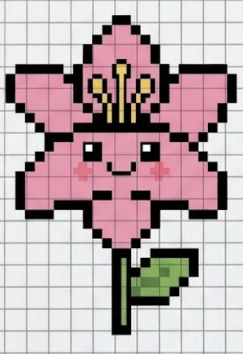
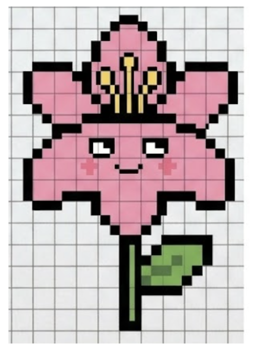
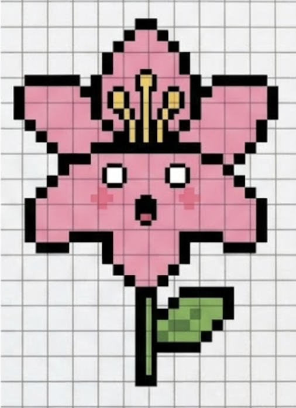
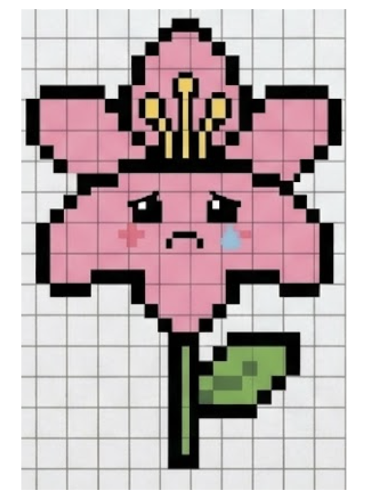
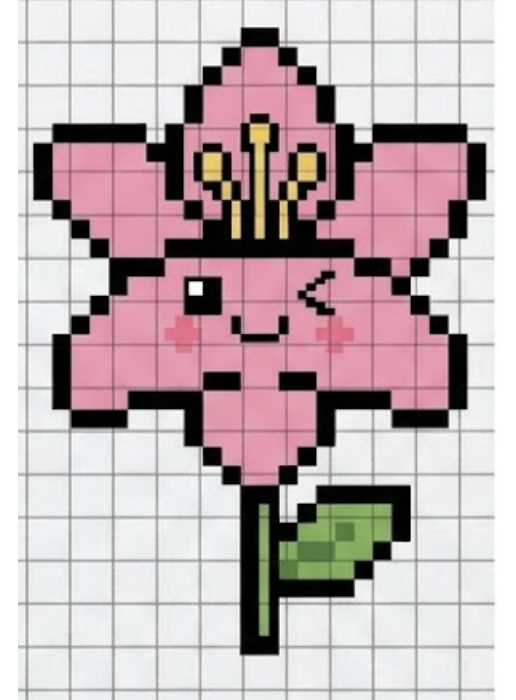

<div align="center">


# Finalily

**The study app that actually makes sense.**

[](https://nextjs.org)
[](https://typescriptlang.org)
[](https://tailwindcss.com)
[](https://supabase.com)
[](LICENSE)



*Meet **Lil' Bit** — your 8-bit study companion. She's always rooting for you.*

</div>

---

## What is Finalily?

Finalily is an AI-powered flashcard and spaced-repetition study app built for students who are tired of apps that get in the way. Generate decks from a topic or a PDF, study with five card types, track your streaks, and share decks with classmates — all in one place.

> **Lil' Bit** is our mascot: a double pun on "Lily" and the 8-bit pixel art style she's drawn in. She reacts to how you're studying — happy when you're on a roll, a little smug when you ace a hard card.

---

## Features

- **AI Deck Generation** — create flashcard decks from any topic or uploaded PDF
- **5 Card Types** — Flashcard, Multiple Choice, Identification, True/False, Cloze
- **Spaced Repetition** — SM-2 algorithm schedules reviews at the right time
- **Study Modes** — Learn, Quiz, and Test sessions with per-card stats
- **Deck Sharing** — share decks via a 6-character code or public link
- **Export** — download decks as PDF or Word documents
- **AI Chat** — ask questions about your deck content mid-session
- **PWA** — installable on mobile and desktop, works offline
- **Streaks & Goals** — track daily study habits

---

## Tech Stack

| Layer | Technology |
|-------|-----------|
| Framework | Next.js 16 (App Router) |
| Language | TypeScript 5 |
| Database | PostgreSQL via Prisma 7 |
| Auth | Supabase Auth (SSR) |
| UI | Tailwind CSS 4 + shadcn/ui + Lucide |
| AI | OpenAI SDK via OpenRouter |
| Testing | Vitest 4 |
| PWA | Serwist |

---

## Getting Started

### Prerequisites

- Node.js 20+
- PostgreSQL database (or a Supabase project)

### Installation

```bash
git clone https://github.com/kennethsolomon/finalily.git
cd finalily
npm install
```

### Environment

Copy `.env.example` to `.env.local` and fill in the required values:

```bash
cp .env.example .env.local
```

| Variable | Description |
|----------|-------------|
| `DATABASE_URL` | PostgreSQL connection string |
| `NEXT_PUBLIC_SUPABASE_URL` | Supabase project URL |
| `NEXT_PUBLIC_SUPABASE_ANON_KEY` | Supabase anon key |
| `OPENROUTER_API_KEY` | OpenRouter API key for AI generation |

### Database

```bash
npx prisma migrate dev
```

### Development

```bash
npm run dev
```

Open [http://localhost:3000](http://localhost:3000).

---

## Scripts

| Command | Description |
|---------|-------------|
| `npm run dev` | Start development server |
| `npm run build` | Production build |
| `npm run start` | Start production server |
| `npm run lint` | Run ESLint |
| `npm run test` | Run Vitest test suite |
| `npm run test:watch` | Run tests in watch mode |

---

## Project Structure

```
src/
├── app/
│   ├── (app)/          # Authenticated routes (decks, settings, onboarding)
│   ├── api/            # API routes (AI generation, draft cards)
│   └── share/          # Public share pages
├── actions/            # Server actions (cards, decks, study, share, profile)
├── components/         # UI components
│   └── cards/          # Per-card-type editor + study components
└── lib/                # Utilities (Prisma, Supabase, SM-2, OpenRouter)
prisma/                 # Schema + migrations
```

---

## Meet Lil' Bit

<div align="center">

| Happy | Smug | Surprised | Sad | Winking | Sleeping |
|:-----:|:----:|:---------:|:---:|:-------:|:--------:|
|  |  |  |  |  |  |

</div>

Lil' Bit reacts to your study performance throughout the app. Ace a hard card and she'll be smug about it. Fall asleep on your reviews and she will too.

---

## Contributing

1. Fork the repository
2. Create a feature branch: `git checkout -b feat/your-feature`
3. Commit using [conventional commits](https://www.conventionalcommits.org): `feat(scope): message`
4. Open a pull request

---

## License

MIT © [Kenneth Solomon](https://github.com/kennethsolomon)
